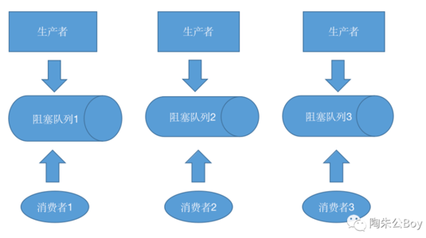

# 生产者消费者组件
## 组件介绍 
该组件基于生产者消费者模式来编码实现，是一款本地化解决流量削峰、解耦、异步的利器。

组件由以下知识点构成：线程池、阻塞队列、LockSupport、Executor框架、final、volatile。此外你还能接触到hash取模算法、接口回调等机制。

组件本身代码量并不大，但知识点比较密集，所以希望大家能花一点时间认真看完。我将从适用场景、架构设计、源码解析这三个角度给大家讲介绍这款组件。

## 架构设计 
☆对象图  

该组件支持“多生产者多消费者”场景，在多核时代充分利用CPU多核机制，消费者多线程并行处理阻塞队列中的数据，加快任务处理速度。

☆逻辑架构图 

该组件内部持有一个工作线程对象数组，当生产者提交数据的时候，会先经过一个route组件(采用hash取模算法)，动态路由到其中一个线程对象内的阻塞队列中存储起来。

等到满足一定条件，工作线程就会将自身线程对象内阻塞队列中的数据转换成指定容量的List对象(BlockQueue的drainto方法有支持),然后调用已经注册的回调函数把数据传递出去。

☆流程图 

大家看下上述这张组件内部工作线程的流程图：

首选我们说此组件对象内部持有一个工作线程对象数组，每个工作线程对象内部持有一个有界阻塞队列实例（ArrayBlockingQueue),方法有run(),add(),timeout()方法。

生产者调用组件自身的add方法后，add方法内部通过hash取模算法动态路由到某个工作线程对象内部的blockingQueue中去。

timeout方法是这款组件设计的一个亮点（容错性设计）👍。

假如实际运行过程中，工作线程内部的阻塞队列内一直只占少许几个对象，如果仅仅只判断队列中的元素个数是否超出指定阈值，再去处理队列中的数据，一旦长时间未超出，工作线程就会一直被阻塞，也将导致队列中的数据长时间堆积。

所以新增的这个timeout()这个机制能应对一旦队列中的数据长时间积压，它会根据时间差即判断当前时间距离上次任务处理时间是否超出指定阈值（可配置），如果超出了也会强制处理队列中的数据。

## 写到最后
如果你对此款组件有任何疑问，欢迎与作者交流。(公众号底部有作者联系方式)
### 公众号：【陶朱公Boy】
