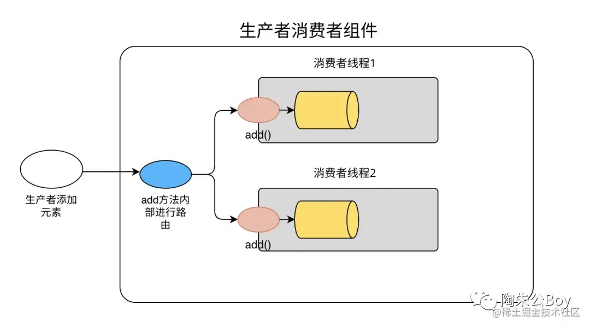
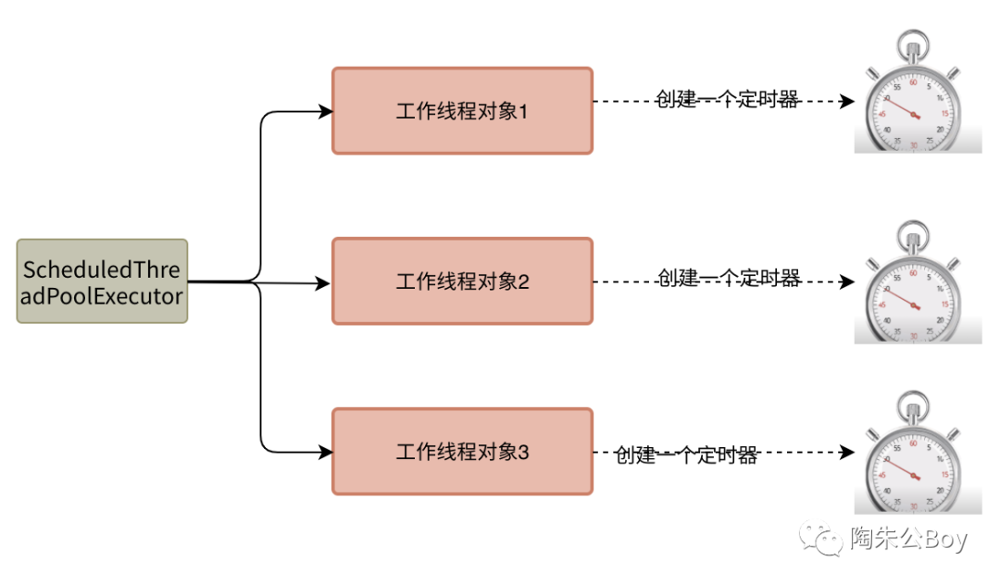

# 生产者消费者组件
## 组件介绍 
该组件基于生产者消费者模式来编码实现，是一款本地化解决流量削峰、解耦、异步的利器。

组件由以下知识点构成：线程池、阻塞队列、LockSupport、Executor框架、final、volatile。此外你还能接触到hash取模算法、接口回调等机制。

组件本身代码量并不大，但知识点比较密集，所以希望大家能花一点时间认真看完。我将从适用场景、架构设计、源码解析这三个角度给大家讲介绍这款组件。

架构设计

☆对象图

图片

该组件支持“多生产者多消费者”场景，在多核时代充分利用CPU多核机制，消费者多线程并行处理阻塞队列中的数据，加快任务处理速度。

☆逻辑架构图

工作线程阻塞：

工作者线程在组件初始化的时候会根据指定threadNum数量完成新建。工作线程一开始运行run方法后，判断条件不满足运行条件，就阻塞自己。
直到生产者调用其add方法检查队列大小是否超过阈值亦或定时线程定时判断距离上次任务执行时间差是否超过指定阈值。只要满足其一，就能唤醒被阻塞的线程，让其继续执行下去。

数据存储：

该组件实例持有一个工作线程对象数组，当生产者提交数据的时候，会先经过一个route组件(采用hash取模算法)，动态路由到其中一个线程对象内的阻塞队列中存储起来。

数据消费：

等到满足一定条件，工作线程就会将对应线程对象内部中阻塞队列的数据转换成指定容量的List对象(BlockQueue的drainto方法有支持),然后传递给回调函数。

☆流程图

我们一起来看下上述这张工作线程内部处理机制图：
图片工作线程内部处理机制

1)add方法：

生产者线程调用组件的add方法后，add方法内部通过hash取模算法，会动态路由到指定工作线程对象，继而调用其内部的add方法存储到内部的阻塞队列中去。

当工作者线程内部的add被调用后，方法底部都会检查当前队列的实际大小是否超过指定阈值(可配置)，如果超过，就会触发LockSupport.unpark方法，唤醒被阻塞的工作线程。

2)timeout方法

ScheduledThreadPoolExecutor在组件初始化新建工作线程的时候，为每一个工作线程对象开启一个定时器，按固定时间间隔周期(可配置)，检查工作线程距离上一次任务处理完的时间差是否超过指定阈值(可配置)，如果超过就会触发LockSupport.unpark方法，唤醒被阻塞的工作线程。

## 写到最后
此组件详细设计文档作者已首发在微信公众号，有兴趣的小伙伴可以到那里去查阅！
### 公众号：【陶朱公Boy】
